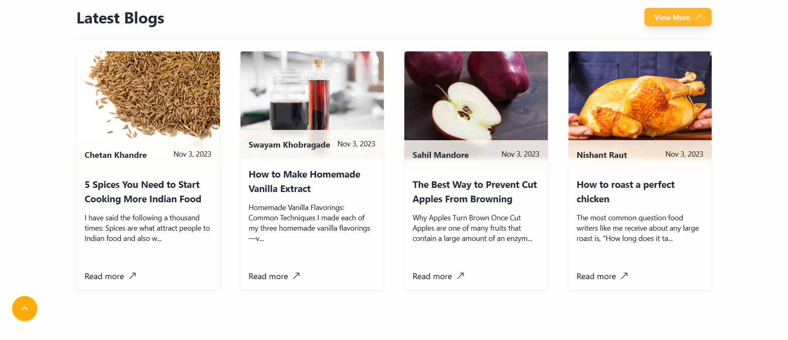

# Recipen 🍴

<h3>Description :</h3> 
Explore a world of flavors with Recipen! Indulge in a community-driven platform where food enthusiasts share their cherished recipes and captivating food blogs. Join to contribute your own culinary creations. Unlock a realm of taste, culture, and creativity.

 

### 📃Features :

<ul>
    <li><strong>Authentication:</strong> Users can securely create accounts and log in to access personalized features and content.</li>
    <li><strong>Recipes:</strong> Explore a rich collection of authentic recipes contributed by the community, covering a wide range of cuisines and tastes.</li>
    <li><strong>Food Blogs:</strong> Engage with insightful and creative food blogs written by enthusiasts, offering valuable insights and cooking inspiration.</li>
    <li><strong>User Access:</strong> users enjoy the privilege of adding and deleting recipes and blogs, creating a dynamic and engaging platform.</li>
    <li><strong>Admin Dashboard:</strong> Admins have access to a dashboard for managing users, recipes, and blogs</li>
    <li><strong>User Profile:</strong> Each user has a personalized profile where they can manage their information.</li>
    <li><strong>Contact Us Page:</strong> A dedicated page for users to reach out with questions, concerns, or feedback, fostering communication.</li>
    <li><strong>Save and Unsave Favorite Recipes:</strong> Users can curate their own collection of favorite recipes for easy access and cooking inspiration.</li>
    <li><strong>Rate and Comment on Recipes:</strong> Registered users can provide ratings and comments on recipes, enhancing the community interaction.</li>
    <li><strong>Comment on Blogs:</strong> Engage in discussions by leaving comments on the food blogs, sharing thoughts and ideas.</li>
    <li><strong>Share Recipe on Social Media:</strong> Users can effortlessly share their favorite recipes on various social media platforms.</li>
</ul>

### Home Page

### Sign up page

### Sign in page

### Profile Page

### Contact Page

### Recipes Page

### Blogs Page

### Single Recipe Page

### Single Blog Page

### Add Recipe Page

### Add Blog Page

### Admin Users Dashbaord

### Admin Recipes Dashboard

### Admin Blogs Dashboard
